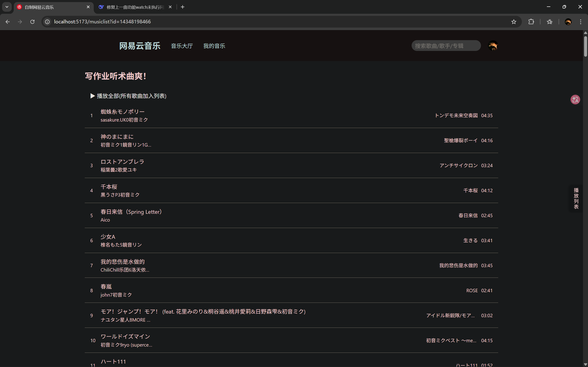
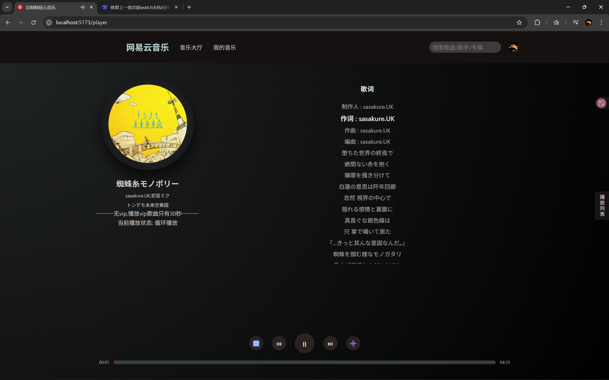

# 🎵 网易云音乐 Web 播放器 (NeteaseCloud Music WebApp)

<p align="center">
  
  <br>
  <em>首页预览</em>
</p>
<br>
<p align="center">
  
  <br>
  <em>歌单详情预览</em>
</p>
<br>
<p align="center">
  
  <br>
  <em>播放界面预览</em>
</p>

> 一个基于 Vue 3 全家桶开发的网易云音乐网页版播放器,本项目仅用于学习和交流前端技术。

## 🌐 在线体验

🚀 **项目已部署上线，[欢迎体验！](https://neteasedemo-production.up.railway.app/)**
> 注：首次加载可能稍慢，请耐心等待。如遇到加载失败，刷新即可。

## 🛠️ 技术栈 (Tech Stack)

- **前端框架:** Vue 3 (Composition API, `<script setup>`)
- **状态管理:** Pinia
- **路由管理:** Vue Router 4
- **HTTP 请求:** Axios
- **构建工具:** Vite

## 🎵 功能特性 (Features)

- **推荐页:** 查看热门推荐歌单,推荐音乐,热门100名歌手。
- **歌手详情:** 查看歌手前200首歌曲并点击播放。
- **搜索功能:** 支持搜索歌曲。
- **登录:** 支持网易云音乐app扫码登录,可退出登录。
- **我的音乐:** 登录后可显示已创建的歌单以及喜欢的音乐
- **歌单详情:** 查看歌单内的所有歌曲并点击播放。
- **音乐播放:** 支持播放、暂停。
- **播放进度:** 显示当前播放时间、总时长，支持点击跳转进度条。
- **歌词显示:** 播放时同步滚动显示歌词。

## 🙏 后端说明 (Backend Acknowledgement)

**本项目本身不包含任何后端代码。**

所有音乐数据接口均来源于开源的 **[NeteaseCloudMusicApiEnhanced](https://github.com/NeteaseCloudMusicApiEnhanced/api-enhanced)**,
请提前下载后端代码并放在根目录下

这是一个基于 Node.js 的网易云音乐 API 接口服务。在此向该项目的作者表示衷心的感谢！

## 📁 项目结构 (Project Structure)

```text
Netcesedemo/
├── api-enhanced-main/          # 后端服务(需自己下载)
│   └── ...                      # 后端代码
├── frontpage/                    # 前端项目
│   ├── src/
│   │   ├── api/                  # API 请求接口
│   │   ├── assets/               # 静态资源
│   │   ├── components/           # 公共组件
│   │   ├── router/               # 路由配置
│   │   ├── stores/               # 状态管理
|   |   ├── utils/                # 工具函数
│   │   ├── views/                # 页面视图
│   │   └── App.vue               
│   └── ...
└── ...
```

## 🚀 快速开始 (Getting Started)
运行本项目前,请先下载 **[Node.js](https://nodejs.cn/download/)**
### 环境要求
  - Node.js 18+（推荐 v20.x）
  - npm 9+
### 一键安装与运行
1.  下载后端服务并放置在项目根目录

2.  进入根目录终端安装所有依赖
    ```bash
    npm run install:all
    ```
3.  一键启动前后端(使用 `concurrently` 依赖并行运行前后端):
    ```bash
    npm run dev
    ```
### 运行成功后：
- 前端访问：`http://localhost:5173`
- 后端 API：`http://localhost:3000`

## 🔍 已知问题 / 待办事项

-  播放进度条暂不支持拖拽
-  移动端适配不完善（建议在PC端使用）
-  部分歌单图片加载较慢（取决于API接口响应速度）
-  还有更多功能未实现


## 📄 开源协议 (License)

[MIT](LICENSE)

## 📧 联系我 (Contact)

- 作者：Danica66
- 邮箱：danica6@qq.com
- GitHub：[Danica66](https://github.com/Danica66)


如果这个项目对你有帮助，欢迎给个 ⭐️！

## 📜 npm 脚本说明

根目录的 `package.json` 中配置了以下便捷脚本：

```json
{
  "scripts": {
    "install:all": "npm i && cd frontpage && npm install && cd ../api-enhanced-main && npm install",
    "dev": "concurrently --names \"SERVER,CLIENT\" -c \"bgBlue.bold,bgGreen.bold\" \"npm run dev:node\" \"npm run dev:vue\"",
    "dev:node": "cd api-enhanced-main && node app.js",
    "dev:vue": "cd frontpage && npm run dev"
  }
}